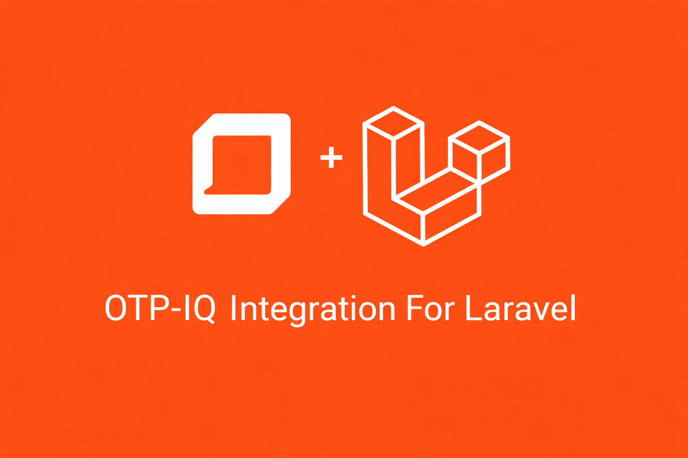

# OTP IQ integration for Laravel.

[](https://packagist.org/packages/ht3aa/otp-iq)
[](https://packagist.org/packages/ht3aa/otp-iq)

OTP IQ integration for Laravel. You will find all the functionality you need to make your Laravel App works easily with their api





## Installation

You can install the package via composer:

```bash
composer require ht3aa/otp-iq
```

You can publish and run the migrations with:

```bash
php artisan vendor:publish --tag="otp-iq-migrations"
php artisan migrate
```

You can publish the config file with:

```bash
php artisan vendor:publish --tag="otp-iq-config"
```

## Changelog

Please see [CHANGELOG](CHANGELOG.md) for more information on what has changed recently.

## Contributing

Please see [CONTRIBUTING](CONTRIBUTING.md) for details.

## Security Vulnerabilities

Please review [our security policy](../../security/policy) on how to report security vulnerabilities.

## Credits

- [Hasan Tahseen](https://github.com/ht3aa)
- [All Contributors](../../contributors)

## License

The MIT License (MIT). Please see [License File](LICENSE.md) for more information.
